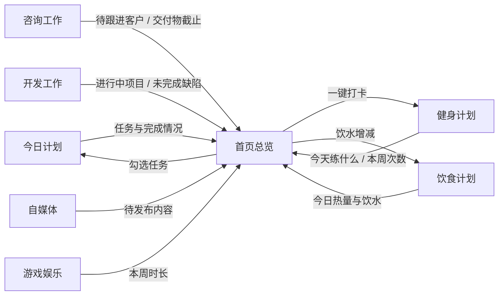

# 个性化工作站 · 产品需求文档（初版 PRD）

| 项目 | 内容 |
| --- | --- |
| 文档版本 | v1.0（初版） |
| 撰写日期 | 2026-09-13 |
| 产品名称 | 个性化工作站 |
| 目标平台 | Windows 10 / 11 桌面程序（WPF + .NET 8，不引入第三方包） |
| 使用范围 | 仅本机、仅本人使用，不需要登录与联网 |
| 文档用途 | 后续开发的唯一依据。开发过程中如与本文件冲突，以本文件为准，并先更新本文件再改代码 |

**已确认的关键决策**

1. 运行形态：WPF 桌面窗口，不使用浏览器网页。
2. 导航形态：左侧分组可折叠导航栏；点击具体模块后，右侧内容区顶端显示该模块的详细标签页。
3. 左侧总导航栏可以通过选项隐藏（隐藏后可从窗口左上角按钮恢复）。
4. 「数据与设置」固定在左侧导航栏底部，不随其他模块一起滚动。
5. 数据文件放在程序同目录的 `data` 文件夹；第一版先创建一个空数据文件。
6. 咨询工作定位为「轻量客户与项目管理 + 简单时长费用记录」，不含开票、账务、税务。

---

## 1. 产品目标与使用场景

### 1.1 产品目标

把日常分散在各个地方的事情（今天要做什么、手上哪些项目、客户聊到哪一步、这周练了几次、今天吃了什么、发了什么内容、玩了多久）统一收进**一个只属于自己的本地软件**里，做到：

- 打开就能看清今天：今天要做什么、有什么正在逼近，一眼看到。
- 每个场景有自己的工具：咨询有客户与项目、健身有周计划与打卡、饮食有食物库与热量，不是同一个任务列表换名字。
- 记录成本足够低：随手能记，不需要额外整理。
- 数据永远在自己手里：一个本机文件，可备份、可恢复，关掉重启都不丢。
- 不打扰：不联网、不推送、不需要登录、不需要维护服务器。

### 1.2 使用者

只有一个人使用（你自己）。没有账号、没有权限、没有协作、没有分享。

### 1.3 使用场景

| 场景 | 使用方式 |
| --- | --- |
| 早上开工 | 打开软件落在首页：看今天要做什么、哪个客户该联系、哪个交付物今天到期 |
| 一天当中 | 用「快速备忘」随手记一句话；完成任务直接勾掉；临时想到的选题丢进自媒体灵感池 |
| 咨询会议前后 | 会议前看客户上一次聊了什么、需求是什么；会议后记录时长、要点，决定这次算不算钱 |
| 开发推进 | 打开开发工作看项目待办与缺陷，完成后勾掉；有复用价值的代码存成片段 |
| 训练当天 | 打开健身计划看今天练什么，按计划打卡，填写实际重量 |
| 吃饭前后 | 从自己的食物库挑食物记四餐，看今天热量和蛋白质够不够 |
| 睡前/周末 | 看近几天完成率、体重趋势、本周娱乐时长，心里有数 |
| 内容发布后 | 在自媒体里手动录入播放、点赞、涨粉，写一句复盘 |
| 换电脑/重装 | 把整个程序文件夹复制走，或从备份文件恢复 |

### 1.4 设计原则

1. **场景优先**：每个模块的界面按它自己的使用方式设计，不追求模块之间长得一样。
2. **单一数据源**：一条数据只在一个地方维护（详见第 6 章），首页只汇总和跳转，不做第二套编辑入口。
3. **改动即落盘**：不需要点保存按钮，编辑后自动写盘，状态栏显示保存时间。
4. **默认安全**：删除有二次确认；恢复、导入、清空前都自动留一份备份；数据文件损坏时自动兜底并保留原文件。
5. **不做多余的事**：不做统计报表系统、不做财务系统、不做社交、不做移动端。

### 1.5 明确的边界

- 单人、单机、单实例；数据不离开本机。
- 不自媒体平台自动取数、不接第三方、不调用 AI。
- 不追求移动端适配与手机访问。

---

## 2. 整体页面框架和导航结构

### 2.1 窗口结构（自上而下四个区域）

```
┌───────────────────────────────────────────────────────────────────────────────┐
│ ① 顶部栏   ☰ 个性化工作站        2026-09-13 星期日   ✓已保存 21:03  ☀         │
├───────────────┬───────────────────────────────────────────────────────────────┤
│ ② 左侧导航栏 ⇔│ ③ 内容区                                                      │
│  （可折叠、   │  ┌─────────────────────────────────────────────────────────┐  │
│    可整体隐藏）│  │ 模块标题 + 一句话说明                                   │  │
│               │  ├─────────────────────────────────────────────────────────┤  │
│  首页总览 ‹   │  │ 详细标签页：客户 | 咨询项目 | 沟通记录 | 费用统计        │  │
│  ── 工作事务  │  ├─────────────────────────────────────────────────────────┤  │
│  今日计划     │  │ 当前标签页的内容（卡片 / 列表 / 看板 / 左列表+右详情）   │  │
│  开发工作     │  │                                                         │  │
│  咨询工作     │  └─────────────────────────────────────────────────────────┘  │
│  ── 内容创作  │                                                               │
│  自媒体       │                                                               │
│  ── 生活健康  │                                                               │
│  健身计划     │                                                               │
│  饮食计划     │                                                               │
│  游戏娱乐     │                                                               │
│               │                                                               │
│  ─────────    │                                                               │
│  数据与设置   │  ← 固定在底部，不随上面的模块滚动                              │
├───────────────┴───────────────────────────────────────────────────────────────┤
│ ④ 状态栏  数据文件：…\data\工作站数据.json │ 3 份备份 │ 已保存 21:03 │ 版本 1.0.0 │
└───────────────────────────────────────────────────────────────────────────────┘
```

- **① 顶部栏**：☰ 显示/隐藏导航栏；产品名；今天日期与星期；保存状态（✓ 已保存时间，失败时变红）；主题切换。
- **② 左侧导航栏**：分组 + 模块；「首页总览」这一行右端是折叠 / 展开按钮（图中 ‹）；可折叠成窄图标条；可整体隐藏；右边界（图中 ⇔）可以用鼠标拖动改变宽度；「数据与设置」固定在底部。
- **③ 内容区**：模块标题区（标题 + 一句话说明）→ 详细标签页 → 当前页内容。
- **④ 状态栏**：数据文件路径（点击可打开所在文件夹）、备份份数、保存时间、版本号。

窗口默认 1360×860，最小 1100×700；记住上次的大小、位置与是否最大化；同一时间只允许运行一个实例。

### 2.2 导航分组

| 分组 | 模块 | 图标语义 |
| --- | --- | --- |
| （不分组，置顶） | 首页总览 | 房子 |
| 工作事务 | 今日计划 | 日历 |
| 工作事务 | 开发工作 | 代码 |
| 工作事务 | 咨询工作 | 联系人 |
| 内容创作 | 自媒体 | 摄像机 |
| 生活健康 | 健身计划 | 心形 |
| 生活健康 | 饮食计划 | 旗帜 |
| 生活健康 | 游戏娱乐 | 星标 |
| （固定底部） | 数据与设置 | 齿轮 |

- 分组标题可以点击折叠/收起，折叠状态会被记住。
- 当前模块高亮显示（底部高亮条 + 主色文字）。
- 导航折叠成图标条时，只显示图标、隐藏文字与分组标题，鼠标悬停显示名称。
- **折叠按钮的位置**：「首页总览」这一行的右端，与「首页总览」同在一个小框架内。展开时显示 `‹`；折叠成图标条后，这一行不再显示「首页总览」图标，只显示 `›`。
- **选中底色铺满整行**：选中「首页总览」时，蓝色底色铺满整个小框架，折叠按钮 `‹` / `›` 也在这块蓝色底内；按钮图标改用主色绘制，保证在底色上清晰可见、不会被盖住。
- **导航栏宽度**：右边界可以用鼠标拖动，范围 180 ~ 420px，默认 236px；双击边界恢复默认宽度；折叠成图标条或整体隐藏时不参与拖动。

### 2.3 详细标签页规则

- 点击左侧模块后，右侧内容区顶端显示该模块的标签页；切换标签只切换内容区，不影响导航。
- 每个模块的标签如下：

| 模块 | 标签页 |
| --- | --- |
| 首页总览 | 今日总览 |
| 今日计划 | 任务清单、月历与完成率 |
| 开发工作 | 项目与待办、代码片段、项目笔记 |
| 咨询工作 | 客户、咨询项目、沟通记录、费用统计 |
| 自媒体 | 内容排期、灵感池、数据复盘、平台管理 |
| 健身计划 | 本周安排、训练记录、身体数据、目标 |
| 饮食计划 | 今日记录、食物库、趋势与目标 |
| 游戏娱乐 | 收藏库、时长记录、统计 |
| 数据与设置 | 数据与备份、外观与导航、关于与危险操作 |

- 只有一个标签的模块不显示标签条（避免无意义的单个标签）。
- 切换模块时标签自动回到第一个；再次切回该模块时保留上次停留的标签。

### 2.4 导航栏的折叠与隐藏

| 操作 | 入口 | 结果 |
| --- | --- | --- |
| 折叠为图标条 | 「首页总览」这一行右端的 `‹`；「数据与设置 → 外观与导航」勾选项 | 导航宽 58px，只显示图标；这一行不再显示「首页总览」，只留 `›`；内容区变宽 |
| 展开回来 | 图标条上的 `›`（位置同上）；「数据与设置 → 外观与导航」勾选项 | 恢复折叠前的宽度 |
| 改变宽度 | 拖动导航栏右边界；双击边界 | 宽度在 180 ~ 420px 之间变化；双击恢复默认 236px |
| 整体隐藏 | 顶部栏 ☰ 按钮；「数据与设置 → 外观与导航」勾选项 | 导航宽 0，内容区铺满；左上角 ☰ 可恢复，恢复后宽度与折叠状态与隐藏前一致 |
| 折叠分组 | 点击分组标题 | 该组模块收起，状态被记住 |

### 2.5 通用交互规则（所有模块一致）

| 场景 | 规则 |
| --- | --- |
| 新增 / 编辑 | 简单表单一律用右侧滑出抽屉；复杂表单用居中弹窗；Esc 关闭，Ctrl+Enter 保存 |
| 删除 | 二次确认（显示对象名称）；删除后出现「已删除 · 撤销」提示条，5 分钟内可撤销 |
| 保存 | 编辑即保存，500ms 防抖写盘；状态栏显示「已保存 HH:mm:ss」；失败变红并可重试 |
| 排序 | 列表支持拖动排序；表格点表头排序 |
| 行内编辑 | 表格/列表双击单元格直接改，回车确认，Esc 取消 |
| 空状态 | 每个空列表显示一句引导 + 一个主操作按钮（如「还没有客户 → 新建客户」） |
| 校验 | 必填项红框 + 红字；日期不合法（截止早于开始）即时提示 |
| 提示 | 右下角轻提示，2 秒自动消失，不打断操作 |
| 长文本 | 笔记类保留换行 |

**快捷键**

| 快捷键 | 作用 |
| --- | --- |
| `Ctrl+1` ~ `Ctrl+9` | 按导航顺序切换模块 |
| `Ctrl+N` | 当前模块新建 |
| `Ctrl+S` | 立即保存 |
| `Ctrl+F` | 聚焦当前页搜索框 |
| `Ctrl+K` | 快速备忘输入 |
| `F2` / `Delete` | 重命名 / 删除选中项 |
| `F5` | 重新加载数据文件 |
| `Esc` | 关闭抽屉/弹窗，取消编辑 |

### 2.6 视觉规范

**浅色主题**

| 用途 | 色值 |
| --- | --- |
| 窗口背景 | `#F4F5F7` |
| 卡片 / 面板 | `#FFFFFF`，边框 `#E5E7EB`，圆角 8px |
| 主色（按钮、选中） | `#2F6FED`，悬停 `#1F5AD6`，浅底 `#E8F0FE` |
| 成功 / 警告 / 危险 | `#1EA672` / `#D98A16` / `#DE4B4B` |
| 主要 / 次要 / 弱化文字 | `#1F2329` / `#5A6270` / `#98A0AC` |

**深色主题**：背景 `#141519`，卡片 `#1E1F25`，边框 `#2E3038`，主色 `#4F8BFF`，文字 `#E6E8EC` / `#A8AEBA`。

- 字体：中文 `Microsoft YaHei UI`，代码与数字 `Cascadia Mono`。
- 字号：正文 13~14，次要 12，模块标题 18，卡片标题 15，关键数字 24。
- 间距：4 / 8 / 12 / 16 / 24 五档；卡片内边距 16；列表行高约 34。
- 图标：使用 Windows 自带 `Segoe MDL2 Assets` 字体图标，不引入第三方图标库。
- 状态色约定：进行中=蓝、已完成=绿、待办=灰、逾期与高风险=红、暂停=橙。
---

## 3. 首页的内容结构

首页是打开软件的第一屏，只做两件事：**让今天一目了然**、**提供最小操作入口**。

### 3.1 顶部提醒条

一行文字，把最需要马上知道的事挑出来（没有就显示"今天没有特别要提醒的事"）：

- 有几个客户该跟进了（含逾期天数）
- 今天/明天到期的交付物
- 今天安排的训练内容（如「上肢推」，休息日显示「今天休息」）
- 昨天没完成、被顺延过来的任务条数

点击提醒条跳到对应模块。

### 3.2 卡片区（3 列自适应，窗口变窄自动降为 2 列 / 1 列）

| 卡片 | 显示内容 | 卡片内可直接做的操作 |
| --- | --- | --- |
| 今日计划 | 完成进度（如 3/7）+ 前 5 条任务 | 勾选完成 |
| 快速备忘 | 最新的置顶与最近 5 条 | 新增、置顶/取消置顶、删除 |
| 客户跟进 | 逾期与今天该联系的客户（逾期红色） | 无（点击跳到咨询工作） |
| 交付物截止 | 最近 3 条交付物（3 天内到期高亮） | 勾选完成 |
| 健身打卡 | 今天该练什么 + 本周已练次数/目标 | 一键打卡（自动生成当天的训练记录） |
| 饮食进度 | 今日热量进度 + 蛋白进度 + 饮水 | +250ml / −250ml |
| 自媒体排期 | 待发布内容前 3 条（含计划日期） | 无（点击跳到自媒体） |
| 开发工作 | 进行中项目数 + 未完成缺陷数 + 本周完成任务数 | 无（点击跳到开发工作） |

### 3.3 首页规则

- 首页**不存储业务数据**，所有数字都从各模块实时汇总得到；首页只额外保存卡片的显示/隐藏与顺序偏好。
- 首页只提供"勾选、打卡、饮水、记备忘"这四类最小操作，其余编辑一律跳到对应模块完成，避免出现两套编辑入口。
- 点击卡片空白处进入对应模块。
- 卡片可以拖动排序，也可以隐藏不关心的卡片（设置会记住）。

---

## 4. 每个模块的用途

| 模块 | 一句话用途 | 不属于它的范围 |
| --- | --- | --- |
| 首页总览 | 今天要做什么、有什么正在逼近，一眼看全 | 不放业务编辑功能 |
| 今日计划 | 安排并完成每天要做的事，能看到自己最近有没有掉链子 | 不做日程提醒/闹钟、不做重复任务规则 |
| 自媒体 | 管理选题、排期和发布后的表现数据（手动录入） | 不抓取平台数据、不自动发布、不写文案 |
| 开发工作 | 跟住自己的项目、待办缺陷和可复用的代码片段 | 不做代码托管、不接 Git 平台、不做需求评审流程 |
| 咨询工作 | 管住客户与咨询项目：聊了什么、要交什么、什么时候再联系、这次算多少钱 | 不做开票、账务、税务、合同管理、客户门户 |
| 健身计划 | 说清楚每周怎么练，记录实际练了什么，看身体数据变化 | 不接健身平台、不同步手环、不做动作库百科 |
| 饮食计划 | 记录每天吃了什么，热量与蛋白质够不够 | 不联网查营养库、不识别食物照片 |
| 游戏娱乐 | 管理想玩/在玩/通关的收藏，记录花掉的时间 | 不接游戏平台、不统计成就 |
| 数据与设置 | 管数据文件、备份恢复、外观导航与危险操作 | 不做报表与数据分析 |

---

## 5. 每个模块第一版最必要的数据和操作

> 说明：以下为第一版必须落地的字段与操作。字段为空的表示可选填。

### 5.1 首页总览

- **数据**：不存业务数据；仅存卡片顺序与显示/隐藏、提醒条已读状态。
- **操作**：勾选今日任务、新增/置顶/删除快速备忘、一键健身打卡、饮水 +250ml/−250ml、点击跳转模块、拖动卡片排序、隐藏卡片。

### 5.2 今日计划

| 数据字段 | 说明 |
| --- | --- |
| 日期 | 任务归属的哪一天 |
| 标题 | 要做的事 |
| 优先级 | 高 / 中 / 低（首页与列表用色条区分） |
| 模块标签 | 开发 / 咨询 / 自媒体 / 健身 / 饮食 / 娱乐 / 生活 / 其他 |
| 是否完成、完成时间 | 勾选后记录时间 |
| 排序序号 | 拖动排序用 |

- **操作**：新增、编辑、勾选完成/取消完成、删除、单条顺延到明天、一键把未完成项全部顺延到明天、按日期切换查看与补录、拖动排序、查看月历（有任务的日期标圆点）与近 7 天完成率。

### 5.3 自媒体

| 数据 | 说明 |
| --- | --- |
| 平台清单 | 名称可增删改，用于所有下拉与筛选 |
| 内容标题 | 这条内容叫什么 |
| 平台 | 可多选 |
| 状态 | 想法 / 草稿 / 待发布 / 已发布 / 放弃 |
| 计划日期、实际发布日期 | 排期与记录 |
| 脚本正文 | 多行文本 |
| 素材清单 | 条目 + 是否完成（如封面、字幕） |
| 发布后数据 | 播放、点赞、评论、转发、涨粉（全部手动填写） |
| 复盘备注 | 一句话总结 |
| 灵感池条目 | 内容 + 标签 + 时间 |

- **操作**：新建/编辑/删除内容、状态流转、灵感一键转为内容、录入发布数据、按平台/状态/月份筛选、视图切换（表格 / 按状态看板）、查看本月统计（发布条数、总播放、平均播放、最高播放）与近 8 周柱状。

### 5.4 开发工作

| 数据 | 说明 |
| --- | --- |
| 项目 | 名称、简介、状态（规划中/进行中/已完成/暂停）、优先级、截止日期、仓库地址（纯文本）、笔记 |
| 待办项 | 所属项目、类型（任务/缺陷/想法）、标题、详情、优先级、状态（待办/进行中/已完成）、创建与完成时间 |
| 代码片段 | 所属项目（可空）、标题、语言、代码正文、说明 |

- **操作**：项目与待办的增删改、状态流转、完成勾选、按项目/类型/状态筛选、项目进度自动按「已完成待办 ÷ 全部待办」计算、片段一键复制到剪贴板、按项目分组查看笔记。

### 5.5 咨询工作

| 数据 | 说明 |
| --- | --- |
| 客户 | 称呼、公司或身份、联系方式（自由文本）、来源、状态（潜在/合作中/暂停/已结束）、备注、下次联系时间 |
| 咨询项目 | 所属客户、名称、需求描述、状态（洽谈/进行中/待交付/已完成/暂停）、开始日期、截止日期、下次联系时间、备注 |
| 交付物（属于项目） | 标题、截止日期、状态、是否完成 |
| 跟进事项（属于项目） | 内容、计划日期、是否完成 |
| 沟通记录 | 日期、客户、项目、类型（会议/电话/微信/邮件/其他）、时长（分钟）、摘要、详细笔记、计费方式（不计费/按小时/一口价）、单价或金额 |
| 费用统计 | 由沟通记录自动汇总：按月、按客户、按项目的总时长与总金额 |

- **操作**：客户与项目增删改、状态切换、交付物与跟进事项勾选、记录一次沟通（按小时时金额自动 = 时长 × 单价）、按客户/项目/月份筛选、查看费用汇总并可下钻到对应沟通记录。
- **边界**：只记录与汇总时长费用，界面内明确标注"不做发票、不做账务、不做税务"。

### 5.6 健身计划

| 数据 | 说明 |
| --- | --- |
| 周计划 | 周几（周一~周日）、标题（如「上肢推」「休息」）、动作清单（动作名、组数、次数、重量提示、备注） |
| 训练记录 | 日期、标题、时长（分钟）、身体感受（很好/正常/疲惫）、备注、动作明细（动作、组数、次数、实际重量） |
| 身体数据 | 日期、体重、体脂、腰围、胸围、臂围、大腿围、备注 |
| 目标 | 目标体重、每周训练次数、备注 |

- **操作**：编辑任意一天的计划、把某天计划复制到其他天、按当天计划开始打卡（预填动作、逐组勾选并填实际重量）、保存/删除训练记录、记录身体数据、查看体重折线图与「与 7 天前 / 30 天前对比」、查看本周达标进度（如 2/3 次）。

### 5.7 饮食计划

| 数据 | 说明 |
| --- | --- |
| 食物库 | 名称、单位（100克 / 1个 / 1勺 等，自由填写）、热量、蛋白质、碳水、脂肪、是否常用、备注 |
| 每日记录 | 日期、四餐（早/午/晚/加餐）各自的食物条目（食物、份量、热量、蛋白/碳水/脂肪）、饮水（毫升）、备注 |
| 目标 | 每日热量、蛋白质、碳水、脂肪、饮水量 |

- **操作**：新增/修改/删除食物库条目、标记常用、按日期添加食物与份量（热量与营养素自动按份量换算）、修改份量、删除条目、饮水增减、切换日期补录、查看今日热量环形进度与三大营养素进度条、查看近 14 天热量趋势与每周达标天数。
- **边界**：营养值全部由使用者自己填写，不联网查询。

### 5.8 游戏娱乐

| 数据 | 说明 |
| --- | --- |
| 收藏条目 | 标题、类型（游戏/电影/剧集/书）、状态（想玩/在玩/已通关/弃坑）、平台、评分（0-10）、价格或备注、开始日期、完成日期 |
| 时长记录 | 日期、条目、分钟数、备注 |

- **操作**：条目增删改、看板视图拖动换列、按类型与状态筛选、快捷 +30 分钟记录时长、查看本周/本月总时长与按类型分布、查看在玩与想玩数量。

### 5.9 数据与设置

| 数据 | 说明 |
| --- | --- |
| 数据文件位置 | 默认程序目录下 `data\工作站数据.json`，界面中完整显示并可打开所在文件夹 |
| 备份 | 自动备份列表（时间、文件名、大小），可恢复、可删除 |
| 外观 | 主题（浅色/深色/跟随系统）、导航显示与折叠、导航栏宽度 |
| 窗口 | 大小、位置、是否最大化（自动记忆） |

- **操作**：打开数据文件夹/备份文件夹、立即保存、重新加载数据文件、立即备份、从备份恢复、从文件导入、切换主题、显示或隐藏导航栏、折叠导航栏（按钮在「首页总览」行右端）、拖动导航栏右边界改宽度、清空所有数据（需二次确认，清空前自动备份）。
- **危险操作保护**：清空、恢复、导入都会先自动生成一份备份，并在界面上写明可回退。

---

## 6. 首页、今日计划和各模块之间的关系

### 6.1 一句话概括

**今日计划管"什么时候做什么"，各模块管"这件事的细节"，首页把两者汇总成今天的一屏。**

### 6.2 数据流向



### 6.3 具体联动规则

| 关系 | 规则 |
| --- | --- |
| 今日计划 ↔ 首页 | 首页显示今天的任务与完成进度，可勾选；勾选结果直接写入今日计划 |
| 今日计划 ↔ 各模块 | 任务的「模块标签」用于按模块分组统计；任务只是"这件事今天要做"，不复制模块里的业务数据 |
| 咨询 → 首页 | 「客户跟进」与「交付物截止」两张卡片的数据**只来自咨询工作**，在咨询模块维护；首页不提供编辑 |
| 健身 → 首页 | 首页"今天练什么"取自周计划里对应的周几；首页「一键打卡」即生成一条当天的训练记录（可在健身计划里继续补充重量） |
| 饮食 → 首页 | 首页热量与饮水来自饮食计划的当日记录；首页的 ±250ml 直接写回当日饮水 |
| 自媒体 → 首页 | 首页只显示待发布内容与计划日期；发布数据必须在自媒体模块录入 |
| 开发 → 首页 | 首页只做数字汇总（进行中项目、未完成缺陷、本周完成任务），编辑在开发模块 |
| 娱乐 → 首页 | 第一版首页不显示娱乐卡片（避免首页过满），仅在各模块内查看 |
| 数据与设置 ↔ 全部 | 所有模块的数据都写在同一个数据文件里，备份/恢复/清空对整个文件生效 |

### 6.4 防止"两处维护"的约定

1. 首页只允许四类写入：勾选任务、备忘、打卡、饮水；其余一律跳转。
2. 同一条业务数据只有一个编辑入口（例如交付物只在咨询工作里改）。
3. 若后续要在首页增加卡片，必须明确它是"汇总显示"还是"可编辑"，不允许出现来源不明的数据。
---

## 7. 本地数据文件、备份和恢复要求

### 7.1 目录结构

```
个性化工作站\
├─ PersonalWorkstation.exe        程序本体
├─ data\
│   ├─ 工作站数据.json            全部数据（唯一的数据源）
│   ├─ backups\                   自动与手动备份
│   ├─ 损坏的数据_时间.json      仅在数据文件损坏时出现（留底，不自动删除）
│   └─ 导入前/恢复前自动备份       恢复与导入前自动生成
└─ logs\                          错误日志（按天分文件）
```

### 7.2 数据文件要求

| 编号 | 要求 |
| --- | --- |
| D1 | 数据文件是**一个独立文件**，路径为程序目录下 `data\工作站数据.json`，UTF-8 编码，缩进良好的可读 JSON，中文按原样保存（不转义成 `\uXXXX`） |
| D2 | 程序首次运行若文件不存在或为空，自动生成一份结构完整但**不含任何记录**的空数据文件（各模块数组为空） |
| D3 | 所有模块的数据都在这一个文件里，不存在第二个数据源（截图、日志除外） |
| D4 | 数据文件可被人工编辑；缺字段时程序要能容错补齐，不能崩溃 |
| D5 | 数据文件版本号写在文件内（`version`），便于以后升级结构 |

### 7.3 保存要求

| 编号 | 要求 |
| --- | --- |
| S1 | 任何编辑后 500ms 内自动写盘，不需要手动保存；状态栏显示「已保存 HH:mm:ss」 |
| S2 | 写盘采用"先写临时文件，再原子替换"的方式，避免写一半断电导致文件损坏 |
| S3 | 写盘失败时状态栏变红并给出重试入口，同时写入 logs 日志 |
| S4 | 关闭窗口时先保存再退出；退出时若数据有变化，自动备份一份 |

### 7.4 备份要求

| 编号 | 要求 |
| --- | --- |
| B1 | 自动备份时机：程序启动时、程序退出时（**仅当数据相对最近一次备份有变化时**才备份，避免重复） |
| B2 | 备份文件名含时间戳，例如 `工作站备份_20260913_2103.json`；同一秒重复时自动加序号 |
| B3 | 备份最多保留最近 60 份，超出后自动清理最旧的 |
| B4 | 界面里可以「立即备份」，也可以在备份列表里查看时间/文件名/大小 |
| B5 | 可以把整个程序文件夹复制到别的盘或 U 盘作为完整备份；程序不依赖注册表或系统目录 |

### 7.5 恢复与导入要求

| 编号 | 要求 |
| --- | --- |
| R1 | 从备份恢复前，先把当前数据自动另存为「恢复前自动备份」；恢复后界面提示可通过它回退 |
| R2 | 从文件导入前，先把当前数据自动另存为「导入前自动备份」 |
| R3 | 恢复与导入都要校验文件内容是否为合法数据文件；不合法则拒绝并给出原因，不破坏现有数据 |
| R4 | 恢复/导入成功后界面数据立即刷新，无需重启程序 |

### 7.6 异常与保护要求

| 编号 | 要求 |
| --- | --- |
| E1 | 启动时若数据文件损坏，自动用最近一次备份恢复，并把损坏文件另存为 `损坏的数据_时间.json`（**绝不直接丢弃**） |
| E2 | 恢复过程在没有可用备份时，重建空数据文件，并明确告知用户原文件已留底 |
| E3 | 只允许同时运行一个程序实例；重复启动时提示并退出，不产生第二个数据写入者 |
| E4 | 未处理的异常写入 `logs\log-日期.txt`，并在界面友好提示，不静默崩溃 |
| E5 | 清空所有数据必须二次确认，且清空前自动备份 |
| E6 | 程序不发起任何网络请求；断网状态下所有功能正常可用 |

---

## 8. 第一版必须完成的功能

按里程碑推进，每个里程碑完成后可实际打开程序检查。

### M1 骨架与数据地基（已完成）

- [x] WPF 主窗口：顶部栏、左侧分组可折叠导航、右侧内容区、底部状态栏
- [x] 点击模块后右侧顶端显示该模块详细标签页
- [x] 「数据与设置」固定在导航栏底部，不随其他模块滚动
- [x] 导航可折叠为图标条、可整体隐藏并可恢复
- [ ] 变更（2026-09-13 追加，尚未实现）：折叠 / 展开按钮移到「首页总览」这一行右端；折叠后该行只显示 `›`；导航栏右边界可拖动改变宽度（180 ~ 420px，双击恢复默认）
- [x] 浅色 / 深色 / 跟随系统主题
- [x] 窗口大小位置记忆、单实例运行
- [x] 数据层：空数据文件生成、自动保存（原子替换）、备份、恢复、导入、损坏兜底
- [x] 「数据与设置」页面全部功能：数据位置、立即保存、重新加载、立即备份、备份列表与恢复、从文件导入、主题与导航开关、清空数据
- [x] 数据层自检与界面截图自检工具

### M2 首页总览 + 今日计划

- [ ] 首页提醒条与 8 张卡片（今日计划、快速备忘、客户跟进、交付物截止、健身打卡、饮食进度、自媒体排期、开发工作）
- [ ] 首页四类最小操作：勾选任务、备忘增删置顶、一键打卡、饮水增减
- [ ] 卡片排序与隐藏
- [ ] 今日计划：任务增删改、勾选、优先级、模块标签、拖动排序、顺延到明天、批量顺延
- [ ] 今日计划：按日期切换查看与补录、月历（有任务标圆点）、近 7 天完成率

### M3 咨询工作 + 开发工作

- [ ] 客户：增删改、状态、下次联系时间、逾期标记、关联项目与最近沟通
- [ ] 咨询项目：需求、状态、起止与截止日期、交付物清单、跟进事项、下次联系时间
- [ ] 沟通记录：类型、时长、摘要、笔记、计费方式与金额自动计算
- [ ] 费用统计：按月/客户/项目汇总时长与金额，可下钻
- [ ] 开发工作：项目、待办与缺陷、代码片段、项目笔记；进度自动计算；片段一键复制

### M4 自媒体

- [ ] 内容排期：增删改、状态流转、平台多选、计划与发布日期、脚本、素材清单
- [ ] 发布后数据手动录入与复盘备注
- [ ] 灵感池：快速捕获、一键转为内容
- [ ] 数据复盘：本月统计与近 8 周柱状
- [ ] 平台管理：平台增删改

### M5 健身计划 + 饮食计划

- [ ] 健身：周计划编辑、复制到其他天、按当天计划打卡（逐组记录）、训练记录列表与详情
- [ ] 健身：身体数据记录、体重折线、与 7/30 天前对比、每周目标进度
- [ ] 饮食：食物库增删改与常用标记
- [ ] 饮食：四餐记录（按份量自动换算热量与营养素）、饮水、今日汇总与进度条
- [ ] 饮食：近 14 天趋势、目标设置

### M6 游戏娱乐

- [ ] 收藏库看板（想玩/在玩/已通关/弃坑）与拖动换列
- [ ] 时长记录与 +30 分钟快捷记录
- [ ] 本周/本月统计与按类型分布

### M7 打磨与验收

- [ ] 快捷键全部可用（Ctrl+1~9、Ctrl+N、Ctrl+S、Ctrl+F、Ctrl+K、F2、Delete、F5、Esc）
- [ ] 每个列表都有空状态引导
- [ ] 删除二次确认与「撤销删除」
- [ ] 表单校验与错误提示
- [ ] 逐页走查第 10 章全部验收项，无阻塞缺陷

---

## 9. 第一版暂时不做的功能

以下内容第一版一概不做，避免范围失控（如后续要做，先更新本文档再开发）：

**账号与多人**

- 用户注册、登录、多用户与权限
- 多人协作、消息通知、审批

**网络与同步**

- 云同步、云数据库、多设备同步
- 公网部署、局域网共享
- 手机 App 与专门的移动端适配

**第三方集成**

- 与微信、抖音、B站等平台自动同步数据
- 自动抓取自媒体表现数据
- GitHub、日历、邮箱或其他第三方服务集成
- 可穿戴设备或健身平台同步
- 在线食物营养数据库

**智能化**

- AI 自动规划、自动写文案、智能营养识别

**超出范围的业务系统**

- 完整的财务、开票、客户关系管理系统（咨询工作只做到"记录 + 汇总"）
- 合同管理、报价单、客户门户

**其他**

- 复杂的数据分析与自定义报表
- 日程提醒、闹钟、系统托盘常驻与开机自启
- 数据导出为 Excel/PDF 等格式（备份文件除外）

---

## 10. 可以实际检查的验收标准

> 检查方式：双击 `PersonalWorkstation.exe`，按下面每一条实际操作一遍。全部通过即视为第一版完成。

### 10.1 启动与窗口

- [ ] 双击 exe 能打开主窗口，标题为「个性化工作站」，无报错弹窗
- [ ] 窗口可以拖动、缩放、最大化；关闭再打开，大小与位置与上次一致
- [ ] 程序已经开着时再次双击 exe，会提示"已经在运行"，不会出现第二个窗口
- [ ] 拔掉网线（或断网）后，程序启动与所有功能照常可用
- [ ] 用资源监视器观察，程序运行期间没有对外网络连接

### 10.2 导航与标签页

- [ ] 左侧按「首页总览 / 工作事务 / 内容创作 / 生活健康」分组显示 8 个模块，「数据与设置」在最底部
- [ ] 点击分组标题能折叠/展开该组，重启后折叠状态仍然保持
- [ ] 「数据与设置」始终在底部：滚动上方模块列表时它不动
- [ ] 点击任意模块，右侧顶端出现该模块的标签页；点击标签只切换内容区
- [ ] 「首页总览」右侧的 `‹` 能把导航折叠成图标条；折叠后这一行不再显示「首页总览」，只显示 `›`，点 `›` 恢复原宽度
- [ ] 拖动导航栏右边界能改变宽度（180~420px），双击边界恢复默认 236px；折叠或隐藏状态下拖不动
- [ ] ☰ 按钮能隐藏整个导航栏，隐藏后左上角按钮可以再次显示，恢复后宽度与折叠状态与隐藏前一致
- [ ] 当前所在模块在导航中有明显高亮

### 10.3 首页

- [ ] 首页显示提醒条与 8 张卡片，数字与各模块里的实际数据一致
- [ ] 在首页勾选一条今日任务，今日计划里该任务同步变为已完成，进度数字同步变化
- [ ] 在首页新增一条备忘，重启程序后仍在；可以置顶与删除
- [ ] 最新备忘输入框按 Ctrl+K 可直接聚焦
- [ ] 首页点「一键打卡」，健身计划里出现一条当天训练记录，本周次数 +1
- [ ] 首页点「+250ml」，饮食计划当天饮水相应增加；点「−250ml」减少
- [ ] 有逾期跟进客户时显示为红色；点击卡片跳到咨询工作
- [ ] 交付物在 3 天内到期时高亮显示
- [ ] 卡片可以拖动排序，隐藏的卡片重启后仍然隐藏

### 10.4 今日计划

- [ ] 可以新增任务并设置优先级与模块标签；列表按优先级分组显示
- [ ] 勾选任务后显示完成状态与完成时间；进度条同步变化
- [ ] 双击任务标题可以直接改名；拖动可以调整顺序
- [ ] 「顺延到明天」把该任务移到明天；批量顺延把今天所有未完成项移到明天
- [ ] 切换到昨天能看到历史任务与完成情况；月历上有任务的日期有标记
- [ ] 近 7 天完成率与实际完成情况一致
- [ ] 删除任务需二次确认，删除后 5 分钟内可以点「撤销」

### 10.5 咨询工作

- [ ] 新建客户，填写称呼、联系方式、下次联系时间；列表按下次联系时间排序，逾期显示红色
- [ ] 新建咨询项目并关联客户，填写需求描述、截止日期与下次联系时间
- [ ] 在项目里添加交付物（带截止日期）与跟进事项，均可勾选完成
- [ ] 记录一次沟通：会议、60 分钟、按小时 600 元 → 金额自动显示 600 元
- [ ] 费用统计里本月合计显示该笔 1 小时 / 600 元，按客户与按项目两个维度都对得上
- [ ] 首页「客户跟进」与「交付物截止」两张卡片能显示上面录入的数据
- [ ] 界面上明确写着"只做记录与汇总，不做发票与账务"

### 10.6 开发工作

- [ ] 新建项目并填写截止日期，项目卡片显示进度条
- [ ] 在项目下新增待办与缺陷；把待办标记为完成后，项目进度按比例变化
- [ ] 可以按「未完成 / 缺陷 / 优先级」筛选
- [ ] 新建代码片段，点击「复制」能把内容复制到剪贴板（可粘贴到记事本验证）
- [ ] 项目笔记能保留换行

### 10.7 自媒体

- [ ] 新建内容，选择平台（可多选）与状态，填写计划日期
- [ ] 状态可以从「想法」一路流转到「已发布」，看板视图拖动也能改状态
- [ ] 已发布内容可以手动填写播放、点赞、评论、涨粉，并写复盘备注
- [ ] 数据复盘页的本月发布条数、总播放、平均播放与实际录入一致
- [ ] 在灵感池输入一个想法，点「转为内容」后出现在内容排期里
- [ ] 平台管理里新增一个平台后，内容编辑的下拉里能看到它

### 10.8 健身计划

- [ ] 编辑周计划：给周一添加动作（名称、组数、次数），保存后仍在
- [ ] 把周一的计划复制到周三，周三内容与周一一致
- [ ] 首页显示"今天练什么"与周计划里对应的周几一致
- [ ] 打卡时按当天计划预填动作，能逐组填写实际重量并保存
- [ ] 训练记录列表按日期倒序显示，可以删除
- [ ] 记录两次体重后，身体数据页出现折线，并能显示与 7 天前/30 天前的对比
- [ ] 目标页显示本周达标进度（已练次数 / 每周目标次数）

### 10.9 饮食计划

- [ ] 在食物库新增一个食物（名称、单位、热量、蛋白质），保存后可用
- [ ] 在今日记录里给午餐添加该食物并填份量，热量与营养素按份量自动换算
- [ ] 修改份量，汇总数字随之变化；删除条目，汇总相应减少
- [ ] 顶部热量环形进度与三大营养素进度条与实际摄入一致；超出目标时明显变色
- [ ] 饮水 +250ml 后进度同步；切换日期可以补录昨天
- [ ] 近 14 天趋势图与实际记录一致

### 10.10 游戏娱乐

- [ ] 新建条目并选择类型与状态，出现在对应的看板列
- [ ] 把条目从「想玩」拖到「在玩」，重启后状态保持
- [ ] 点「+30 分钟」后，本周总时长增加 30 分钟
- [ ] 统计页的本周/本月时长与按类型分布与记录一致

### 10.11 数据、备份与恢复

- [ ] 「数据与设置」里显示的路径与实际文件位置一致，点「打开数据文件夹」能打开该目录
- [ ] 点「立即备份」后，备份列表出现一条新记录（含时间、文件名、大小）
- [ ] 新增几条数据 → 立即备份 → 再修改数据 → 恢复到刚才的备份：数据回到备份时的状态
- [ ] 恢复完成后，备份列表里能看到「恢复前自动备份」，用它可以把数据退回去
- [ ] 「从文件导入」选择另一个数据文件后，数据被替换且可正常使用；导入前数据已自动备份
- [ ] 手工把 `工作站数据.json` 改坏（例如删掉一半内容）→ 重启程序：提示已用最近备份恢复，且目录里出现 `损坏的数据_时间.json`
- [ ] 清空所有数据需要二次确认，清空后各模块均为空，且清空前自动生成了备份

### 10.12 持久化与可靠性

- [ ] 随便改点数据，直接关闭程序再打开：改动还在，状态栏保存时间更新
- [ ] 改完数据后用任务管理器强制结束进程，再打开：改动仍在（因为改动后即写盘）
- [ ] 数据目录里只有 `data` 与 `logs` 两类可见内容，没有写到别的目录或注册表
- [ ] 程序运行中不弹广告、不弹更新提示、不提示登录

---

## 附录 A. 数据文件结构（第一版）

```json
{
  "version": 1,
  "updatedAt": "2026-09-13 21:03:00",
  "settings": {
    "theme": "light",
    "navVisible": true,
    "navCollapsed": false,
    "collapsedGroups": [],
    "windowWidth": 1360,
    "windowHeight": 860,
    "windowLeft": 100,
    "windowTop": 100,
    "windowMaximized": false
  },
  "quickNotes": [],
  "plans": {},
  "social": { "platforms": [], "contents": [], "ideas": [] },
  "dev": { "projects": [], "items": [], "snippets": [] },
  "consulting": { "clients": [], "projects": [], "logs": [] },
  "fitness": { "goals": {}, "plan": [], "sessions": [], "body": [] },
  "diet": { "targets": {}, "foods": [], "days": {} },
  "entertainment": { "library": [], "sessions": [] }
}
```

- `plans` 的键是日期（如 `2026-09-13`），值是当天的任务数组。
- `diet.days` 的键是日期，值包含四餐条目与饮水。
- 新增字段时保持向后兼容：读取时缺字段自动补默认值。

## 附录 B. 已确认决策记录

| 日期 | 决策 |
| --- | --- |
| 2026-09-13 | 运行形态由"浏览器中本地运行"改为 **WPF 桌面窗口**，其余需求不变 |
| 2026-09-13 | 咨询工作 = 轻量客户与项目管理 + 简单时长费用记录（不做开票与账务） |
| 2026-09-13 | 左侧为**分组可折叠**导航栏；点击模块后右侧顶端显示该模块详细标签页 |
| 2026-09-13 | 左侧总导航栏可通过选项**整体隐藏**，并可随时恢复 |
| 2026-09-13 | 「数据与设置」**固定在导航栏底部**，不随其他模块滚动 |
| 2026-09-13 | 数据放在程序同目录 `data` 文件夹，第一版先创建空数据文件 |
| 2026-09-13 | 工程需同时支持 VS Code 与 Visual Studio 2022 打开（提供 .sln 与 .vscode 配置） |
| 2026-09-13 | 「折叠 / 展开导航栏」按钮从顶部栏移到左侧导航栏「首页总览」这一行的右端；折叠后该行只显示 `›` |
| 2026-09-13 | 左侧导航栏右边界可拖动改变宽度（180 ~ 420px，默认 236px，双击恢复默认） |

## 附录 C. 术语

| 术语 | 含义 |
| --- | --- |
| 模块 | 左侧导航里的一个功能板块（如咨询工作） |
| 标签页 | 某个模块内部的子视图（如咨询工作下的"客户"） |
| 卡片 | 首页上的一个信息方块 |
| 交付物 | 咨询项目里需要交付给对方的东西（方案、报告、培训等） |
| 跟进事项 | 咨询项目里需要你自己推进的一件小事 |
| 数据文件 | `data\工作站数据.json`，本产品唯一的数据源 |