# 个性化工作站 · 数据流图（DFD）

> 面向课程作业展示。模块范围以 `界面设计验收.html` 为准，字段定义取自 `初版PRD.md` 第 5 章，
> 数据流与实现细节对照 `个性化工作站-源码/PersonalWorkstation` 的实际代码。

## 0. 阅读说明

| 项目 | 取值 |
| --- | --- |
| 建模方法 | 结构化分析方法（SA），自顶向下逐层分解 |
| 符号体系 | **Yourdon / DeMarco**（加工用圆，数据存储用双横线） |
| 层次 | 上下文图（0 层）→ 0 层分解图 → 1 层子图 |
| 图幅数量 | 8 张（含 2 张系统边界外的辅助图） |
| 配套内容 | 数据字典、父子图平衡性自检 |

### 符号约定

| 元素 | Yourdon 标准符号 | 本文档（Mermaid）记号 | 说明 |
| --- | --- | --- | --- |
| 外部实体 | 矩形 | `["…"]` | 系统边界外的数据来源或去向 |
| 加工 | 圆 | `(("…"))` | 对数据做变换，编号 `x.y` |
| 数据流 | 带箭头的线 | `-->\|"…"\|` | 线上标注流动的数据名 |
| 数据存储 | 双横线（开口矩形） | `[("…")]` | 静态存放，编号 `D1`、`D2`… |

> **关于符号的一点说明**：Mermaid 没有 Yourdon 的双横线数据存储符号，本文档用圆柱体（数据库符号）代替，语义完全等价；加工用圆、外部实体用矩形，与 Yourdon 一致。若课程严格要求双横线，把 `docs/dfd/` 里的图导入 draw.io 替换一下形状即可，数据流本身不用改。
>
> 每张图下方已经附好导出的 PNG（见 `docs/dfd/` 目录），可直接插入 Word 报告。

### 三条绘制纪律

1. **不画控制流。** 「用户点了按钮」「程序判断是否启动」属于控制，不进图；进图的只能是按钮产生的**数据**。
2. **父子平衡。** 子图所有跨边界的输入输出，必须与父图中该加工的输入输出一一对应，不多不少。第 9 节给出自检表。
3. **逐层分解。** 每张子图只展开父图中的一个加工，一次一层，不跳层。

---

## 图 1 上下文图（0 层）

把整个「个性化工作站」视为一个加工，只画它与外部世界的交互。这是所有后续分解的基准。

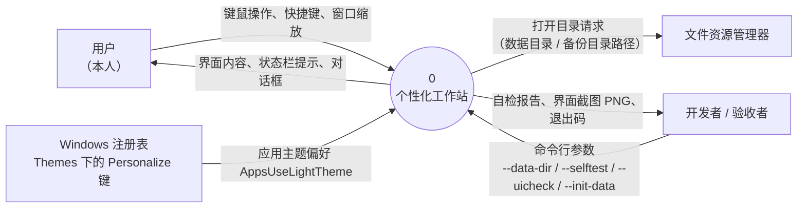

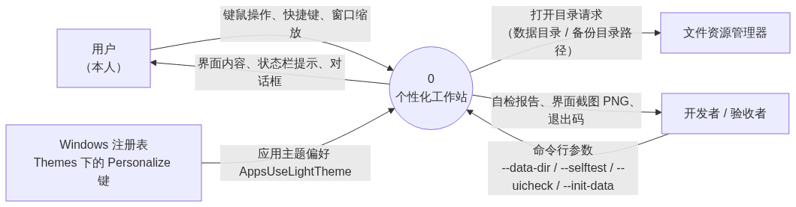

**设计说明**

- 只有 4 个外部实体，且全部是单机资源，**没有任何网络外部实体**——这正是需求 E6（程序不发起任何网络请求）在图上的体现。
- 「打开目录请求」是唯一一条流向操作系统外壳的数据流，它传递的是**目录路径**这个数据，不是「调用 ShellExecute」这个动作。
- 注册表方向是**单向只读**（只取偏好，不回写），所以只有一条流。DFD 允许单向数据流，不必为了对称硬凑反向箭头。

---

## 图 2 0 层分解图

把上下文图中的加工 0 展开成 7 个主要加工和 7 个数据存储。

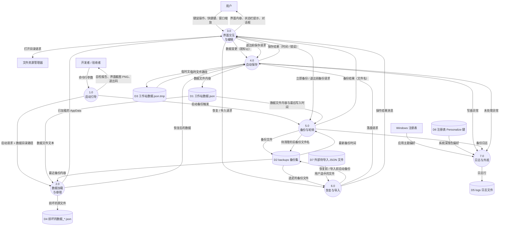

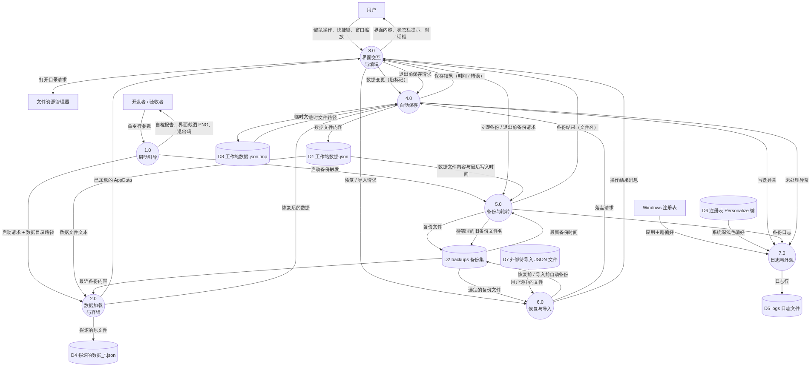

**设计说明**

- **为什么单独有 2.0 和 4.0 两个加工？** 读和写走的是完全不同的路径：读要处理「文件不存在 / 内容损坏 / 缺字段」三种异常，写要处理「防抖合并 / 原子替换 / 写失败」。合成一个加工会让子图无法表达分支。
- **D3 临时文件是真实存在的数据存储**，不是实现细节的凑数。`WriteAtomic` 先写 `.tmp` 再 `File.Replace`，这个中间态在磁盘上确实短暂存在，按 SA 方法应当如实画出。
- **6.0 不直接写 D1**，而是把数据交给 4.0 统一落盘。这样「所有写盘都经过同一条原子写路径」这个设计约束在图上就固化了。

---

## 图 3 加工 2.0 子图：数据加载与容错

展开最关键的一条容错链路：数据文件损坏时如何不丢数据。

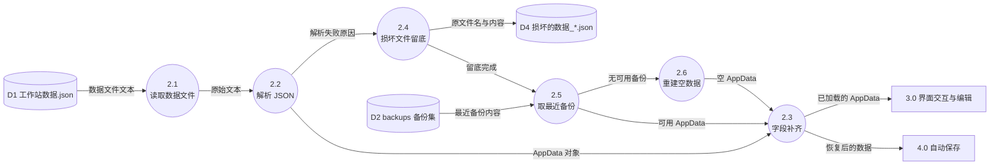

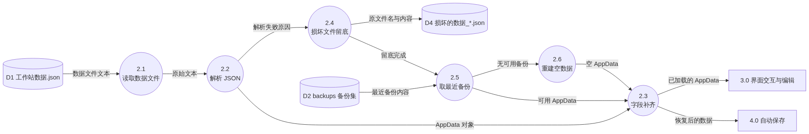

**设计说明**

- 2.4 的输入是「解析失败原因」，输出是「原文件名与内容」——注意它把**损坏的文件本身**当作数据往外送，而不是直接删掉。对应需求 E1「绝不直接丢弃」。
- 2.3「字段补齐」是需求 D4 的落点：手工编辑过的数据文件可能缺字段，补齐后界面不会崩。
- 三条汇入 2.3 的路径（2.2 正常、2.5 从备份恢复、2.6 重建空数据）覆盖了全部异常分支，没有遗漏的出口。

---

## 图 4 加工 4.0 子图：自动保存

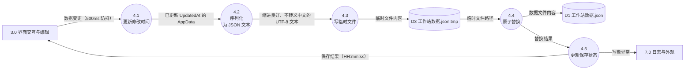

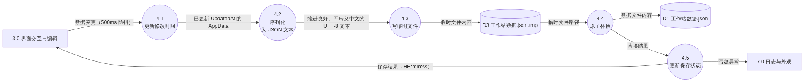

**设计说明**

- 4.1 与 4.2 分开画，是因为「更新修改时间」和「序列化」是两件独立的事，序列化策略（`AppJson.Options`）变化不影响时间戳逻辑。
- 4.4 同时消费 D3、产出 D1，把「先写临时文件、再原子替换」这条需求 S2 画成了两条数据流，一眼能看出中途断电只会丢临时文件、不会损坏正式文件。

---

## 图 5 加工 5.0 子图：备份与轮转

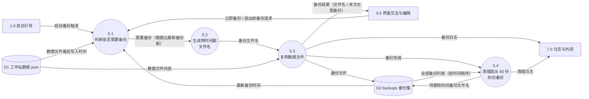

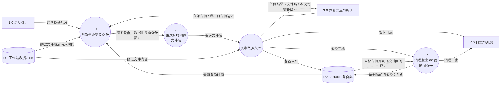

**设计说明**

- 5.1 是一个**判断型加工**：它比较「数据文件最后写入时间」与「最新备份时间」两个数据，只有前者更新才继续。这是需求 B1「仅当有变化时才备份」的落点。判断逻辑在 DFD 里表现为数据流的分支，而不是画一个菱形决策框。
- 5.2 与 5.3 分开，是因为文件名生成有一条隐藏规则：同一秒内重复备份要自动加序号，这属于「生成文件名」这个加工的内部逻辑。
- 5.4 的输入是 D2 的全量列表、输出是待删除名单，形成一条**从存储回到存储**的数据流，表示备份集的自我维护。

---

## 图 6 加工 6.0 子图：恢复与导入

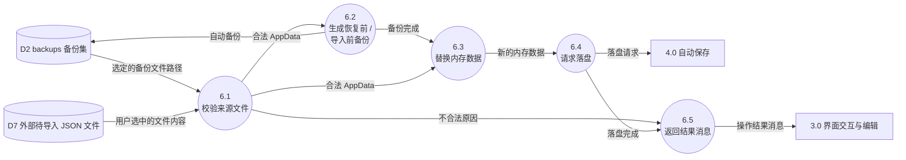

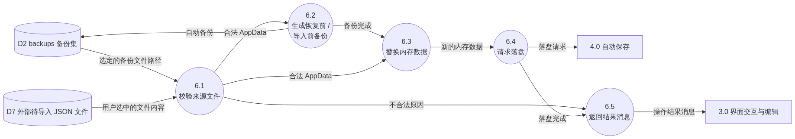

**设计说明**

- 6.1 是安全闸门：不论来源是备份还是外部文件，都先校验是不是合法数据文件。不合法就地返回，**不触碰现有数据**，对应需求 R3。
- 6.2 的存在保证「恢复错了还能退回来」：先写一份「恢复前自动备份」或「导入前自动备份」，再动内存数据。对应需求 R1、R2。
- 6.4 把落盘委托给 4.0，因此恢复操作与普通编辑走的是同一条写盘路径，不会出现两套写盘代码。

---

## 图 7 开发与验收链路（系统边界外）

严格来说命令行自检与截图属于开发期工具，不在产品的运行时边界内。单独成图，既保持图 1 的干净，又能在答辩时体现完整的验证手段。

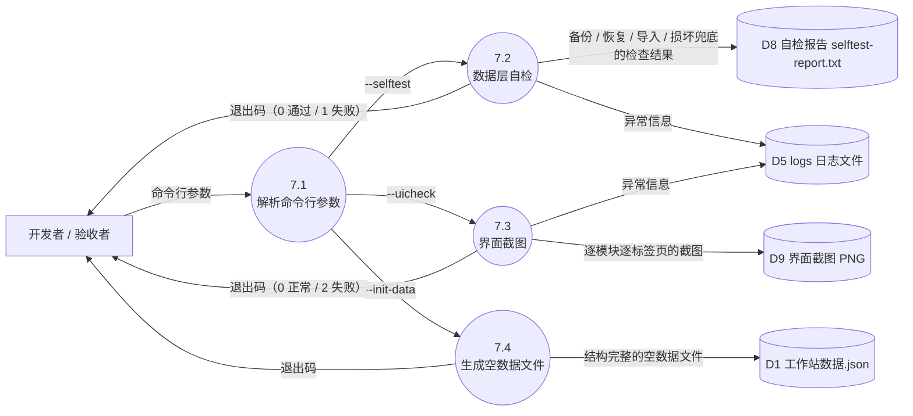

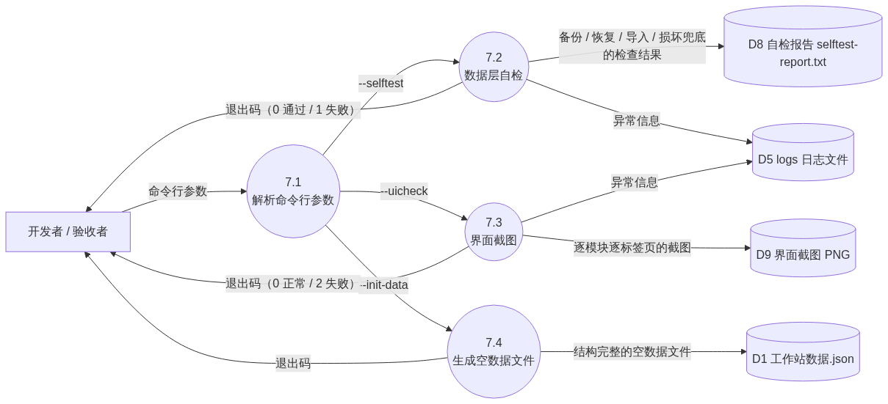

**设计说明**

- 7.2 的自检覆盖 16 项，包括初始化、中文不转义、备份、恢复、导入、损坏兜底，是第 4 节那些容错设计的**可执行证据**。
- 7.3 会遍历全部 12 个模块 36 个标签页逐个截图，等于把「导航与标签页」的验收标准自动化了。

---

## 图 8 开发协作数据流（GitHub 仓库）

与产品运行时无关，属于开发过程的数据流。同样单独成图。

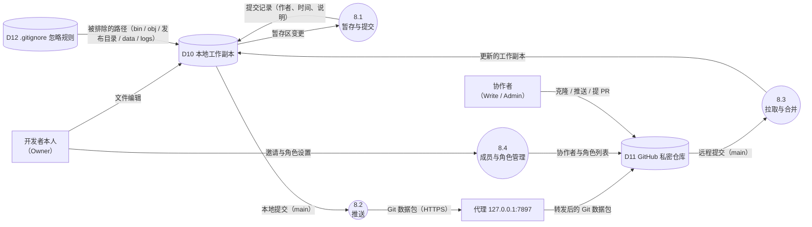

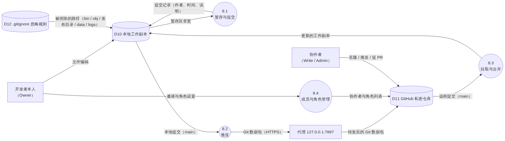

**设计说明**

- 代理是这条链路上**真实存在的一跳**：本机直连 `github.com:443` 不通，Git 的 `http.https://github.com.proxy` 指向本地代理后才有数据流动。如实画出，便于复现环境。
- D12 的箭头指向本地工作副本而不是加工，表示忽略规则的作用是**筛选进入版本库的数据**——它决定了哪些数据根本不进入这条流水线。

---

## 9. 数据字典

### 9.1 外部实体

| 编号 | 名称 | 说明 | 输入（流向系统） | 输出（系统流向它） |
| --- | --- | --- | --- | --- |
| E1 | 用户（本人） | 唯一的使用者，通过键鼠操作程序 | 键鼠操作、快捷键、窗口缩放 | 界面内容、状态栏提示、对话框 |
| E2 | Windows 注册表 | 提供系统深浅色偏好 | 应用主题偏好 `AppsUseLightTheme` | — |
| E3 | 文件资源管理器 | 接收打开目录请求 | — | 打开目录请求（目录路径） |
| E4 | 开发者 / 验收者 | 通过命令行驱动自检与截图 | 命令行参数 | 自检报告、界面截图 PNG、退出码 |

### 9.2 加工

| 编号 | 名称 | 输入 | 输出 |
| --- | --- | --- | --- |
| 1.0 | 启动引导 | 命令行参数、启动请求 | 已加载的 AppData、启动备份触发、自检报告、截图、退出码 |
| 2.0 | 数据加载与容错 | D1 数据文件文本、D2 最近备份内容 | 已加载的 AppData、损坏的原文件、恢复后的数据 |
| 3.0 | 界面交互与编辑 | 键鼠操作、已加载的 AppData、保存结果、操作结果消息 | 界面内容、数据变更、各类操作请求 |
| 4.0 | 自动保存 | 数据变更、退出前保存请求、落盘请求 | D1 数据文件内容、D3 临时文件内容、保存结果、写盘异常 |
| 5.0 | 备份与轮转 | 启动备份触发、备份请求、D1 时间与内容、D2 备份时间 | D2 备份文件、待清理的旧备份文件名、备份结果、备份日志 |
| 6.0 | 恢复与导入 | 恢复 / 导入请求、D2 选定备份、D7 外部文件 | D2 自动备份、落盘请求、操作结果消息 |
| 7.0 | 日志与外观 | 写盘异常、未处理异常、D6 系统偏好、备份日志 | D5 日志行、界面主题 |

### 9.3 数据存储

| 编号 | 名称 | 组成 | 读写方 |
| --- | --- | --- | --- |
| D1 | `data\工作站数据.json` | 见 9.5 全部模块记录 | 2.0 读、4.0 写、5.0 读、7.4 写 |
| D2 | `data\backups\工作站备份_*.json` | 备份文件集 = 文件名 + 大小 + 生成时间 + 数据快照；最多 60 份 | 5.0 读写、6.0 读写 |
| D3 | `data\工作站数据.json.tmp` | 待替换的完整 JSON 文本 | 4.0 写 |
| D4 | `data\损坏的数据_*.json` | 解析失败的原文件，保留不删 | 2.0 写 |
| D5 | `logs\log-YYYYMMDD.txt` | 日志行 = 时间 + 级别 + 消息 | 7.0 写 |
| D6 | 注册表 `HKCU\...\Themes\Personalize` | `AppsUseLightTheme` 整数值 | 7.0 读 |
| D7 | 外部待导入 JSON 文件 | 用户自选的数据文件 | 6.0 读 |
| D8 | `selftest-report.txt` | 自检结论 + 逐项 PASS / FAIL | 7.2 写 |
| D9 | 界面截图目录 | `序号-模块-标签页.png` | 7.3 写 |
| D10 | 本地工作副本 | 工作区文件 + `.git` 版本库 | 8.1 / 8.2 / 8.3 读写 |
| D11 | GitHub 私密仓库 | 远程提交历史 + 成员与角色 | 8.2 / 8.3 / 8.4 读写 |
| D12 | `.gitignore` 忽略规则 | 被排除路径的模式列表 | 直接约束 D10 的内容 |

### 9.4 主要数据流

| 编号 | 名称 | 来源 → 去向 | 组成 |
| --- | --- | --- | --- |
| F01 | 键鼠操作 | E1 → 3.0 | 导航点击 + 表单编辑 + 快捷键（Ctrl+1~9、Ctrl+S、F5） |
| F02 | 界面内容 | 3.0 → E1 | 模块与标签页 + 列表与图表 + 状态栏保存时间 + 对话框 |
| F03 | 应用主题偏好 | E2 → 7.0 | `AppsUseLightTheme`（0 = 深色，1 = 浅色） |
| F04 | 打开目录请求 | 3.0 → E3 | 目录绝对路径（数据目录 / 备份目录） |
| F05 | 命令行参数 | E4 → 1.0 | `--data-dir` 路径 / `--selftest` / `--uicheck` / `--init-data` |
| F06 | 已加载的 AppData | 2.0 → 3.0 | 见 9.5 全部模块记录 |
| F07 | 数据变更（脏标记） | 3.0 → 4.0 | 变更发生的时间点（触发 500ms 防抖） |
| F08 | 数据文件内容 | 4.0 → D1 | 缩进良好、中文不转义的 UTF-8 JSON 文本 |
| F09 | 临时文件内容 | 4.0 → D3 | 同上，写入 `.tmp` 后再原子替换 |
| F10 | 保存结果 | 4.0 → 3.0 | 成功标志 + 保存时间 `HH:mm:ss` / 失败原因 |
| F11 | 备份文件 | 5.0 → D2 | 数据文件完整副本 + 带时间戳的文件名 |
| F12 | 备份结果 | 5.0 → 3.0 | 备份文件名 / 「本次无需备份」 |
| F13 | 损坏的原文件 | 2.0 → D4 | 原文件内容 + 新文件名 `损坏的数据_时间.json` |
| F14 | 最近备份内容 | D2 → 2.0 | 时间最新的备份快照 |
| F15 | 自动备份 | 6.0 → D2 | `恢复前自动备份_*.json` / `导入前自动备份_*.json` |
| F16 | 落盘请求 | 6.0 → 4.0 | 待写入的 AppData |
| F17 | 操作结果消息 | 6.0 → 3.0 | 成功提示 / 拒绝原因 |
| F18 | 日志行 | 7.0 → D5 | `[时间] [级别] 消息` |
| F19 | Git 数据包 | 8.2 → D11 | 本地提交对象 + 差异（经本地代理转发） |
| F20 | 远程提交 | D11 → 8.3 | `refs/heads/main` 上的提交对象 |

### 9.5 各模块记录的数据元素

数据文件 D1 的完整结构。所有模块并列挂在根对象下，用同一个 `version` 号统一演进。

| 模块 | 记录 | 数据元素 |
| --- | --- | --- |
| 全局 | 数据文件根 | 版本号、更新时间、设置、首页布局、快速备忘、今日计划 |
| 设置 | 应用设置 | 主题、导航可见、导航折叠、导航宽度、折叠的分组、当前学期、窗口宽高与位置、是否最大化、字号档 |
| 首页总览 | 首页布局 | 卡片顺序、隐藏的卡片、提醒条已读时间 |
| 今日计划 | 任务 | 标识、标题、优先级、模块标签、关联来源、是否完成、创建时间、完成时间、排序序号 |
| 课程与作业 | 课程 | 标识、名称、教师、教室、学分、周次范围、单双周、颜色标签、学期、备注 |
| 课程与作业 | 课表格子 | 标识、课程、星期、起止节次、教室、是否停课、调课说明、备注 |
| 课程与作业 | 作业与实验 | 标识、课程、标题、类型、布置日期、截止时间、状态、提交时间、得分、备注 |
| 课程与作业 | 考试 | 标识、课程、标题、考试时间、地点、形式、备注 |
| 课程与作业 | 复习条目 | 标识、课程、知识点、是否掌握、备注 |
| 项目实战 | 项目 | 标识、名称、类型、描述、状态、技术栈、仓库地址、起止时间、截止日期、备注、创建与更新时间 |
| 项目实战 | 成员 | 标识、项目、姓名、学号、角色、联系方式 |
| 项目实战 | 待办项 | 标识、项目、类型、标题、详情、优先级、负责人、状态、创建与完成时间 |
| 项目实战 | 里程碑 | 标识、项目、名称、截止日期、是否完成 |
| 项目实战 | 会议纪要 | 标识、项目、日期、参与人、结论、待办 |
| 项目实战 | 代码片段 | 标识、项目、标题、语言、代码正文、说明、标签、创建时间 |
| 项目实战 | 技术笔记 | 标识、项目、标题、正文、标签、创建与更新时间 |
| 刷题算法 | 题目记录 | 标识、平台、题号、标题、难度、标签、日期、状态、耗时、提交次数、思路与要点、代码、复习次数、上次复习、下次复习 |
| 刷题算法 | 专题 | 标识、名称、目标题数、已刷题数、掌握度、备注 |
| 刷题算法 | 错题本 | **派生数据**，不单独存储：由状态为「需复习」的题目汇聚而成 |
| 实习求职 | 目标公司 | 标识、公司名、行业、岗位方向、地点、优先级、招聘时间线、状态、备注 |
| 实习求职 | 投递记录 | 标识、公司、岗位、渠道、投递日期、简历版本、状态、下一步动作与截止时间、备注 |
| 实习求职 | 面试记录 | 标识、投递、公司、岗位、轮次、日期、形式、面试官、问题清单、回答要点、复盘、结果、下一轮时间 |
| 实习求职 | Offer | 标识、公司、岗位、薪资、城市、转正机会、福利、到岗时间、答复截止日期、状态、备注 |
| 实习求职 | 简历版本 | 标识、版本名、用途、更新时间 |
| 竞赛与证书 | 竞赛 | 标识、竞赛名、级别、类型、报名时间、比赛时间、成员、指导教师、状态、奖项、名次、备赛笔记 |
| 竞赛与证书 | 证书 | 标识、名称、类别、报名时间、考试时间、考点、状态、成绩、证书编号、有效期、文件路径 |
| 技术输出 | 平台清单 | 平台名称列表 |
| 技术输出 | 内容 | 标识、标题、平台、状态、计划日期、发布日期、大纲、正文、代码仓库、素材清单、阅读、点赞、收藏、评论、转载、复盘、标签、创建时间 |
| 技术输出 | 灵感 | 标识、内容、标签、创建时间 |
| 健身计划 | 周计划 | 标识、星期、标题、备注、动作清单（动作名、组数、次数、重量、备注） |
| 健身计划 | 训练记录 | 标识、日期、标题、时长、感受、备注、动作明细 |
| 健身计划 | 身体数据 | 标识、日期、体重、体脂、腰围、胸围、臂围、大腿围、备注 |
| 健身计划 | 目标 | 目标体重、每周训练次数、备注 |
| 饮食计划 | 食物库 | 标识、名称、单位、热量、蛋白、碳水、脂肪、是否常用、备注 |
| 饮食计划 | 每日记录 | 日期 → 四餐条目（标识、食物、名称、份量、单位、热量与三大营养素）+ 饮水 + 备注 |
| 饮食计划 | 目标 | 每日热量、蛋白、碳水、脂肪、饮水量 |
| 游戏娱乐 | 收藏条目 | 标识、标题、类型、状态、平台、评分、价格、备注、开始与完成日期 |
| 游戏娱乐 | 时长记录 | 标识、条目、日期、分钟数、备注 |

---

## 10. 父子图平衡性自检

对照图 1 与图 2，逐条核对外部数据流。这是评审时最容易被追问的地方。

| # | 图 1 中的数据流 | 图 2 中对应流向 | 是否一致 |
| --- | --- | --- | --- |
| 1 | 用户 → 0：键鼠操作、快捷键、窗口缩放 | 用户 → 3.0 | ✅ |
| 2 | 0 → 用户：界面内容、状态栏提示、对话框 | 3.0 → 用户 | ✅ |
| 3 | 注册表 → 0：应用主题偏好 | 注册表 → 7.0 | ✅ |
| 4 | 0 → 文件资源管理器：打开目录请求 | 3.0 → 文件资源管理器 | ✅ |
| 5 | 开发者 → 0：命令行参数 | 开发者 → 1.0 | ✅ |
| 6 | 0 → 开发者：自检报告、界面截图、退出码 | 1.0 → 开发者 | ✅ |

**结论**：图 2 的跨边界流与图 1 完全一致，无新增、无遗漏，父子图平衡。

内部加工（2.0 / 4.0 / 5.0 / 6.0）的子图平衡性同样成立，核对方法相同：把子图看成一个黑盒，其对外流应与图 2 中该加工的输入输出一致。例如加工 4.0 在图 2 中的进出是「数据变更 / 退出前保存请求 → 数据文件内容 + 临时文件内容 + 保存结果 + 写盘异常」，图 4 中 4.1 收到变更、4.4 写 D1、4.3 写 D3、4.5 返回结果与异常，逐条对应。

---

## 11. 与设计文档的对应关系

| 本文档 | 对应 PRD 章节 | 对应验收稿 |
| --- | --- | --- |
| 图 1 上下文图 | 1.5 明确的边界、7.6 E6 | — |
| 图 2 0 层图 | 6.2 数据流向、2.2 导航分组 | `MODULES` / `GROUPS` |
| 图 3 加载与容错 | 7.6 E1、E2；7.2 D2~D5 | — |
| 图 4 自动保存 | 7.3 S1~S3 | — |
| 图 5 备份与轮转 | 7.4 B1~B4 | — |
| 图 6 恢复与导入 | 7.5 R1~R4 | 数据与设置页 |
| 图 7 开发与验收链路 | 8. M1 骨架、10. 验收标准 | 验收清单四组 |
| 图 8 开发协作数据流 | — | — |

**模块与标签页清单**（图 2 中加工 3.0 的分组依据，取自验收稿 `MODULES`）

| 分组 | 模块 | 标签页 |
| --- | --- | --- |
| （置顶） | 首页总览 | 今日总览 |
| 学习事务 | 今日计划 | 任务清单、月历与完成率 |
| 学习事务 | 课程与作业 | 课程表、作业与实验、考试与复习 |
| 开发实战 | 项目实战 | 项目与待办、团队协作、代码片段、技术笔记 |
| 开发实战 | 刷题算法 | 题目记录、专题进度、错题本 |
| 升学求职 | 实习求职 | 目标公司、投递记录、面试记录、Offer 对比 |
| 升学求职 | 竞赛与证书 | 竞赛记录、证书与考试 |
| 技术输出 | 技术输出 | 内容排期、灵感池、数据复盘、平台管理 |
| 生活健康 | 健身计划 | 本周安排、训练记录、身体数据、目标 |
| 生活健康 | 饮食计划 | 今日记录、食物库、趋势与目标 |
| 生活健康 | 游戏娱乐 | 收藏库、时长记录、统计 |
| （固定底部） | 数据与设置 | 数据与备份、外观与导航、关于与危险操作 |
