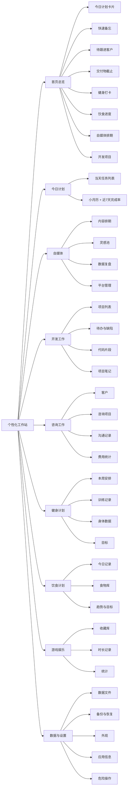
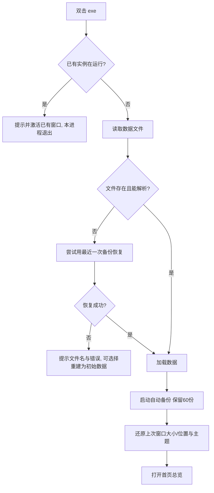
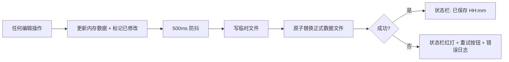
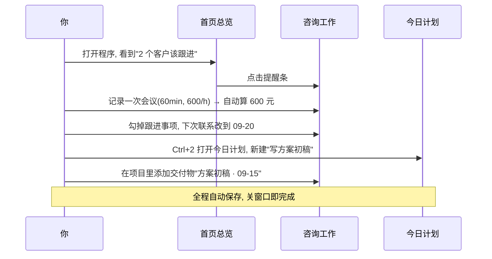

# 个性化工作站 · 界面结构与交互设计（v1 设计稿）

> ⚠️ 本文是**早期设计稿**：里面的「自媒体 / 开发工作 / 咨询工作」等模块清单已被**计科版**取代。
> 开发依据以 `初版PRD.md` 为准，界面核对请用 `界面设计验收.html`。本文仅供历史参考。

> 本文件是设计稿，不含代码。技术基线已改为 **WPF 桌面应用**（原"浏览器中运行"方案作废）。
> 目标：单人、单机、无登录、无联网；数据存在本机独立文件中，可备份、可恢复，重启不丢。

---

## 1. 设计前提

| 项目 | 决定 |
| --- | --- |
| 运行形态 | Windows 桌面程序，双击 exe 直接打开窗口（不需要浏览器、不需要装服务） |
| 技术框架 | .NET 8 + WPF（MVVM），不引入第三方 NuGet 包，离线可编译 |
| 数据存储 | 单机 JSON 文件（可读可手改），旁边配 `backups` 备份目录 |
| 使用者 | 只有你一个人，无账号、无权限、无多用户 |
| 网络 | 完全不联网；不自媒体抓数、不接第三方、不调 AI |

**设计原则**

- 打开就能用：默认落在"首页总览"，常用操作不超过两次点击。
- 改动即刻落盘：任何时候关窗口、断电、重启，数据都还在。
- 场景化：9 个模块各有各的专用界面，不是同一个任务列表改名。
- 只做记录与整理，不做财务系统、不做统计分析平台。

---

## 2. 窗口整体结构

```
┌──────────────────────────────────────────────────────────────────────────────────────┐
│ ① 顶部栏   个性化工作站   2026-09-13 星期日        快速备忘⌨  主题☀  🔍 保存状态●    │
├────────────┬─────────────────────────────────────────────────────────────────────────┤
│ ② 导航栏   │ ③ 内容区                                                                │
│ （可折叠） │  ┌───────────────────────────────────────────────────────────────────┐  │
│            │  │ 页面标题 + 一句话说明                        [次要操作] [主操作]  │  │
│ 首页总览   │  ├───────────────────────────────────────────────────────────────────┤  │
│ 今日计划   │  │ 工具条：筛选 / 搜索 / 日期切换 / 视图切换 （按页面不同）           │  │
│ 自媒体     │  ├───────────────────────────────────────────────────────────────────┤  │
│ 开发工作   │  │                                                                   │  │
│ 咨询工作   │  │ 主内容：卡片 / 列表 / 看板 / 左列表+右详情 / 选项卡内页            │  │
│ 健身计划   │  │                                                                   │  │
│ 饮食计划   │  └───────────────────────────────────────────────────────────────────┘  │
│ 游戏娱乐   │                                                                         │
│ 数据与设置 │                                                                         │
├────────────┴─────────────────────────────────────────────────────────────────────────┤
│ ④ 状态栏  数据文件：data\工作站数据.json（1.2 MB） │ 已保存 21:03 │ 自动备份 3 个    │
└──────────────────────────────────────────────────────────────────────────────────────┘
```

**区域说明**

- **① 顶部栏**：应用名、今天日期与星期、快速备忘（随手记一句话的热键入口）、主题切换、全局搜索、保存状态灯（绿=已保存 / 黄=保存中 / 红=失败可重试）。
- **② 导航栏**：9 个模块固定顺序；可折叠成窄图标条（适合小屏/专注）；当前项高亮；鼠标悬停显示名称。
- **③ 内容区**：统一"标题区 + 工具条 + 主内容"三段式，所有页面结构一致，切换不迷路。
- **④ 状态栏**：数据文件位置、最后保存时间、备份数量；保存失败时在这里出现"重试"按钮。

**窗口规格**：默认 1360×860，最小 1100×700，支持最大化；记忆上次窗口大小与位置；关闭时若有未保存改动先落盘再退出。

---

## 3. 导航与页面地图



---

## 4. 通用交互规则（所有页面一致）

| 场景 | 交互 |
| --- | --- |
| 新增/编辑 | 右侧滑出抽屉（简单表单）或居中模态窗（复杂表单）；`Esc` 关闭，`Ctrl+Enter` 保存 |
| 删除 | 二次确认弹窗（显示对象名称 + "不可撤销"），删除后顶部出现"已删除 · 撤销"提示条，5 分钟内可撤销 |
| 保存 | 编辑即保存；改动后 500ms 防抖写盘；状态栏显示"已保存 HH:mm"；失败则红灯 + 重试按钮 + 错误详情 |
| 列表排序 | 拖动排序（计划、看板）；表格支持点表头排序 |
| 行内编辑 | 表格/列表双击单元格直接改，回车确认，Esc 取消 |
| 搜索筛选 | 每个列表页工具条左侧有搜索框 + 至少一个关键筛选器；过滤结果为空显示"无匹配结果 + 清除筛选" |
| 空状态 | 图形 + 一句话 + 主操作按钮（例如"还没有咨询客户 → 新建客户"） |
| 校验 | 必填项红色描边 + 下方红字说明；日期冲突（截止早于开始）即时提示 |
| 提示消息 | 右下角轻提示（保存成功/复制成功），2 秒自动消失，不打断操作 |
| 长文本 | 笔记类用多行文本框，保留换行；展示时按换行渲染 |

**快捷键**

| 快捷键 | 作用 |
| --- | --- |
| `Ctrl+1` ~ `Ctrl+9` | 切换模块（顺序同导航） |
| `Ctrl+N` | 在当前模块新建（如新建任务/客户/内容） |
| `Ctrl+S` | 立即写盘（平时会自动保存） |
| `Ctrl+F` | 聚焦当前页面搜索框 |
| `Ctrl+K` | 打开快速备忘输入 |
| `F2` / `Delete` | 重命名 / 删除选中项 |
| `F5` | 重新从数据文件加载 |
| `Esc` | 关闭抽屉、弹窗、取消编辑 |

**鼠标/触控板**：单击打开详情，右键出上下文菜单，中键无特殊行为；不依赖悬停才能操作的隐藏按钮。

---

## 5. 各模块界面结构

### 5.1 首页总览

```
┌ 今天 2026-09-13 星期日 ──────────────────────────── 早上好 ☀ ──────────────┐
│ ⚠ 提醒条：2 个客户该跟进了 · 1 个交付物今天到期 · 今天安排的是「上肢推」    │
├──────────────────────────┬──────────────────────────┬──────────────────────┤
│ 今日计划  3/7 ▓▓▓▓░░░░░  │ 快速备忘          新增 ▸ │ 客户跟进          2 逾期│
│ ☐ 写咨询方案（高）       │ ★ 记得给张总回电话       │ ⚠ 李女士 · 今天       │
│ ☑ 晨跑 5km               │ · 买蛋白粉               │ · 王工 · 逾期 2 天    │
│ ☐ 剪辑视频脚本           │ · 预约牙医               │ 打开咨询工作 →        │
│ 打开今日计划 →           │ Ctrl+K 随手记            │                      │
├──────────────────────────┼──────────────────────────┼──────────────────────┤
│ 交付物截止          1 今天│ 健身打卡     本周 2/3 次  │ 饮食进度              │
│ 方案初稿 · 今天          │ 今天：上肢推             │  ◕ 1420 / 2000 kcal   │
│ 需求文档 · 3 天后        │ [ 一键打卡 ]             │  蛋白 86/120g 水 1.5L │
│ 打开咨询工作 →           │ 打开健身计划 →           │ 打开饮食计划 →        │
├──────────────────────────┼──────────────────────────┼──────────────────────┤
│ 自媒体排期        3 待发 │ 开发工作    4 进行中      │ 记录今天              │
│ 09-15 视频号 · 选题A     │ 未完成缺陷 5 个           │ 体重 / 心情 / 一句话   │
│ 09-17 B站 · 复盘vlog     │ 本周完成 12 项            │ [ 快速记录 ]          │
│ 打开自媒体 →             │ 打开开发工作 →            │                      │
└──────────────────────────┴──────────────────────────┴──────────────────────┘
```

- 布局：3 列卡片网格，窗口变窄时自动降为 2 列/1 列。
- 卡片内容实时读取各模块数据；点击卡片空白处进入对应模块。
- 卡片内可直接完成最小操作：勾选今日任务、勾选备忘、一键健身打卡、+250ml 饮水。
- 卡片可拖拽排序、可隐藏不关心的卡片（保存在设置里）。

### 5.2 今日计划

```
┌ 今日计划 2026-09-13 星期日     [ ← 前一天 ][ 今天 ][ 后一天 → ]      [+ 新建任务] ┐
│ 完成 3/7 ▓▓▓▓░░░░ 43%        日期选择：2026-09-13 ▾                              │
├──────────────────────────────────────────────┬───────────────────────────────────┤
│ 高优先级                                      │   2026 年 9 月                    │
│ ☐ ▉ 写咨询方案                [咨询]  ⋯      │  一 二 三 四 五 六 日             │
│ ☐ ▉ 提交需求文档              [咨询]  ⋯      │      1  2  3  4  5  6             │
│ 普通                                          │  7  8  9 10 11 12 13              │
│ ☐ 剪辑视频脚本                [自媒体] ⋯     │ 14 15 16 17 18 19 20              │
│ ☐ 回复开发群消息              [开发]  ⋯      │ （点上色圆点=当天有任务）         │
│ 已完成 3                                      │                                   │
│ ☑ 晨跑 5km                    [健身] ⋯       │  近 7 天完成率                    │
│ ☑ 记录早餐                    [饮食] ⋯       │  ▁▃▅▂▆█▅  平均 68%               │
└──────────────────────────────────────────────┴───────────────────────────────────┘
```

- 任务行：复选框、优先级色条（红/黄/灰）、标题（双击改名）、模块标签、拖动手柄、`⋯` 菜单（编辑 / 移到明天 / 复制 / 删除）。
- 底部工具条：`把未完成项顺延到明天`。
- 切换日期可查看与补录历史；跨天未完成项在首页提醒条提示。

### 5.3 自媒体

```
┌ 自媒体   [内容排期] [灵感池] [数据复盘] [平台管理]                    [+ 新建内容] ┐
│ 本月已发 6 条 · 总播放 12.4万 · 均播 2.1万        [全部平台▾][全部状态▾][搜索]   │
├──────────────────────────────────────────────────────────────────────────────────┤
│ 标题            平台      状态      计划日期   已发数据                           │
│ 选题A 复盘     视频号    ● 待发布   09-15       —                                 │
│ 上班族健身vlog  B站      ● 已发布   09-08      播放 3.2万 赞 812 涨粉 96         │
│ 时间管理三点   抖音      ● 草稿     09-16       —                                 │
└──────────────────────────────────────────────────────────────────────────────────┘
   点任意行 → 右侧抽屉：
   ┌ 内容详情 ─────────────────────────────┐
   │ 标题 / 平台（多选）/ 状态（想法·草稿·待发布·已发布·放弃）│
   │ 计划日期 / 实际发布日期              │
   │ 脚本正文（多行）                     │
   │ 素材清单（可勾选：封面、字幕、素材）  │
   │ ── 发布后数据（手动填写）──           │
   │ 播放 32000  点赞 812  评论 64  涨粉 96 转发 55 │
   │ 复盘一句话                            │
   └──────────────────────────────────────┘
```

- **内容排期**：表格 + 视图切换（表格 / 按状态看板）；状态用颜色徽章；已发布才显示数据列。
- **灵感池**：卡片流（想法 + 标签 + 时间），操作：`转为内容`（一键带过标题）、`删除`；顶部快速捕获框。
- **数据复盘**：本月统计卡 + 近 8 周发布数/播放量柱状 + 每条内容数据明细表（可排序）。
- **平台管理**：平台名称增删改（默认：微信公众号、视频号、抖音、B站、小红书、知乎、即刻），用于所有下拉与筛选。
- 明确边界：数据全部手动录入，不做任何自动抓取。

### 5.4 开发工作

```
┌ 开发工作   项目 4 个 · 未完成缺陷 5 个 · 本周完成 12 项            [+ 新建项目]   ┐
├────────────────────┬─────────────────────────────────────────────────────────────┤
│ 项目列表           │ 「个性化工作站」  ● 进行中   截止 10-01   ▓▓▓▓▓░░ 62%      │
│ ● 个性化工作站 62% │ [待办与缺陷] [代码片段] [项目笔记]                          │
│ ● 客户官网改版 30% │ ── 待办与缺陷 ──────────────────────────────  [+ 新建]      │
│ ○ 脚本工具箱 100%  │ ☐ [缺陷] 首页卡片在窄窗口重叠      高  ⋯                    │
│ ○ 学习笔记    10%  │ ☐ [任务] 补数据备份恢复测试        中  ⋯                    │
│                    │ ☑ [想法] 加一个快捷键面板          低  ⋯                    │
│ [+ 项目]           │ ── 代码片段 ────────────────────────────────  [+ 新建]      │
│                    │ 片段：日期格式化工具  C#  [复制]  [编辑]                     │
│                    │ ── 项目笔记 ────────────────────────────────  [+ 新建]      │
└────────────────────┴─────────────────────────────────────────────────────────────┘
```

- 左栏项目卡片：状态（规划中/进行中/已完成/暂停）、进度条（由待办完成比自动算）、截止日期（3 天内高亮）。
- 右栏三个选项卡：**待办与缺陷**（类型徽章：任务/缺陷/想法，优先级、状态、完成时间）、**代码片段**（标题 + 语言 + 代码，等宽显示，一键复制）、**项目笔记**（多行文本，保留换行）。
- 项目字段：名称、简介、状态、优先级、截止日期、仓库地址（纯文本备注，不做集成）、创建/更新时间。

### 5.5 咨询工作（v1 重点模块）

```
┌ 咨询工作   [客户] [咨询项目] [沟通记录] [费用统计]                    [+ 新建]     ┐
├──────────────────────────┬───────────────────────────────────────────────────────┤
│ 客户                      │ 客户：李女士   合作中     下次联系：今天 ⚠            │
│ 李女士  合作中   今天⚠    │ 公司/身份：某教育公司 产品负责人                       │
│ 王工    潜在     3 天后   │ 联系方式：微信 · 138****1234                          │
│ 张总    暂停     已完成   │ ── 关联项目 ─────────────────────────────────────      │
│                           │ 「增长咨询」 进行中  交付 09-20  下次联系 09-14        │
│                           │ ── 最近沟通 ────────────────────────────────────      │
│                           │ 09-08 会议 60min  付费(600/h)  摘要：确认调研范围      │
│                           │ 08-30 电话 25min  不计费      摘要：初次沟通           │
└──────────────────────────┴───────────────────────────────────────────────────────┘
```

- **客户**：状态（潜在 / 合作中 / 暂停 / 已结束）；字段：称呼、公司或身份、联系方式（自由文本）、来源、备注、下次联系时间。列表按"下次联系时间"升序，逾期红色标记。
- **咨询项目**：关联客户；字段：名称、需求描述、状态（洽谈 / 进行中 / 待交付 / 已完成 / 暂停）、开始日期、截止日期、下次联系时间。
  - **交付物清单**：标题 + 截止日期 + 状态 + 勾选完成；首页取最近到期的 3 条。
  - **跟进事项**：一句话 + 计划日期 + 完成勾选。
- **沟通记录**（时间线倒序）：日期、客户、项目、类型（会议 / 电话 / 微信 / 邮件 / 其他）、时长（分钟）、摘要、详细笔记、计费方式（不计费 / 按小时 / 一口价）+ 单价或金额 → 自动算金额。
- **费用统计**：月份切换 + 累计；三块内容：本月总时长与总金额、按客户汇总表、按项目明细表；每行可下钻到对应沟通记录。
  - 边界声明（界面内会写一句）：仅记录与汇总时长/费用，不做发票、不做账务、不做税务。

### 5.6 健身计划

```
┌ 健身计划   [本周安排] [训练记录] [身体数据] [目标]                   [+ 开始打卡] ┐
├──────────────────────────────────────────────────────────────────────────────────┤
│ 周一 上肢推              [编辑] [复制到其他天]                                    │
│   卧推          4 组 × 8-10 次   重量提示 60-70kg                                │
│   哑铃肩推      3 组 × 10 次                                                      │
│ 周二 有氧+核心   慢跑30min / 卷腹3×20 / 平板3×60s                                 │
│ 周三 下肢        深蹲4×8 / 罗马尼亚硬拉3×10 / 腿举3×12                            │
│ 周四 休息                                                                        │
│ 周五 上肢拉      引体4×8 / 杠铃划船3×10 / 面拉3×15                                │
│ 周六 全身/球类   硬拉3×5 / 分腿蹲3×10 / 有氧20min                                 │
│ 周日 休息/拉伸   拉伸15min / 泡沫轴10min                                          │
└──────────────────────────────────────────────────────────────────────────────────┘
```

- **本周安排**：7 张纵向卡片（周一起始可调），每天可编辑标题与动作清单；`复制到其他天` 支持周一→周三这种复用；休息日显示为浅色"休息"。
- **训练记录**：左列表（日期 + 标题 + 时长）＋右详情（每个动作的组次重量逐组记录、总时长、身体感受、备注）。`开始打卡`会按"今天计划"预填动作，逐组打勾并填实际重量，结束时一键保存本次记录。
- **身体数据**：表格（日期、体重、体脂、腰围、胸围、臂围、大腿围）＋体重折线图（自绘，无需第三方图表库）＋与 7 天/30 天前对比。
- **目标**：目标体重、每周训练次数、备注；页面顶部显示本周达标进度（如 2/3 次）。

### 5.7 饮食计划

```
┌ 饮食计划  [今日记录] [食物库] [趋势与目标]             [ ← 前一天 ][ 今天 ][ 后一天 → ]┐
│ 热量 ◕ 1420 / 2000 kcal     蛋白 86/120g ▓▓▓▓▓░░  碳水 140/230g ▓▓▓▓░░  脂肪 52/65g │
│ 饮水 1.5 / 2.0 L   [ +250ml ] [ -250ml ]                                            │
├──────────────────────────────┬───────────────────────────────────────────────────────┤
│ 早餐                         │ 鸡蛋 1个 · 燕麦 60g · 牛奶 250ml                      │
│ 午餐                         │ 米饭 200g · 鸡胸肉 150g · 西兰花 200g                 │
│ 晚餐                         │ （空）  [ + 添加食物 ]                                │
│ 加餐                         │ 蛋白粉 1勺                                             │
└──────────────────────────────┴───────────────────────────────────────────────────────┘
```

- **今日记录**：按日期切换；四餐分区，每餐列出食物条目（名称、份量、热量、蛋白/碳水/脂肪），可改份量、删除、`+ 添加食物`（弹出食物选择器：搜索 + 输入份量 + 实时显示热量预览）。
- 顶部汇总条：热量环形进度（超出目标变橙）、三大营养素进度条、饮水增减按钮。
- **食物库**：自建食物表（名称、单位如"100克/1个/1勺"、热量、蛋白质、碳水、脂肪、是否常用）；可增删改；常用食物在选择器里置顶。明确说明：营养值由你自己填写，不联网查库。
- **趋势与目标**：近 14 天热量柱状 + 蛋白折线；目标设置（热量、蛋白、碳水、脂肪、饮水）；每周达标天数统计。

### 5.8 游戏娱乐

```
┌ 游戏娱乐  [收藏库] [时长记录] [统计]     [全部类型▾][全部状态▾][搜索]    [+ 新建]    ┐
├───────────────┬───────────────┬───────────────┬──────────────────────────────────┤
│ 想玩 (5)      │ 在玩 (2)      │ 已通关 (18)   │ 弃坑 (3)                         │
│ ─────────     │ ─────────     │ ─────────     │ ─────────                        │
│ 黑神话：悟空  │ 空洞骑士 12h  │ 星露谷物语    │ 某网游                           │
│ 价格 268      │ ★9  Steam     │ ★10           │ ★4                               │
│ 星际拓荒      │ 只狼 8h       │ 塞尔达        │                                  │
└───────────────┴───────────────┴───────────────┴──────────────────────────────────┘
```

- **收藏库**：看板视图（想玩 / 在玩 / 已通关 / 弃坑），条目可拖动换列；字段：标题、类型（游戏/电影/剧集/书）、平台（Steam/PS/Switch/书等自由文本）、评分（0-10）、备注（愿望单直接写价格与打折预期）、开始与完成日期。
- **时长记录**：时间线列表（日期 + 条目 + 分钟 + 备注）；提供 `+30 分钟` 快捷按钮，方便随手记。
- **统计**：本周/本月总时长、按类型时长分布条、在玩与想玩数量；不做复杂报表。

### 5.9 数据与设置

```
┌ 数据与设置 ─────────────────────────────────────────────────────────────────────────┐
│ ── 数据文件 ──────────────────────────────────────────────────────────────         │
│  位置：D:\工作站\data\工作站数据.json     大小 1.2 MB   最后写入 21:03              │
│  [ 打开所在文件夹 ]  [ 重新加载 ]  [ 更换数据文件位置 ]                             │
│ ── 备份与恢复 ────────────────────────────────────────────────────────────         │
│  自动备份：每次启动 + 每次退出（保留最近 60 份）        [ 立即备份 ]                 │
│  备份列表：工作站备份_20260913_2103.json  412 KB  [ 恢复 ]  [ 删除 ]                │
│  [ 从文件导入备份 ]  恢复到旧备份前会自动先把当前数据另存一份                        │
│ ── 外观 ─────────────────────────────────────────────────────────────────          │
│  主题：[浅色] [深色] [跟随系统]     字号缩放：[小][标准][大]    导航：[折叠][展开]   │
│ ── 应用 ─────────────────────────────────────────────────────────────────          │
│  应用名称 [个性化工作站]    开机不自动启动 · 单实例运行 · 版本 1.0.0                 │
│ ── 危险操作 ──────────────────────────────────────────────────────────────          │
│  [ 清空所有数据 ]（需输入"清空"确认）  [ 恢复为初始示例数据 ]                        │
└──────────────────────────────────────────────────────────────────────────────────────┘
```

- 数据文件默认放在 exe 同目录的 `data` 文件夹（便携：整个文件夹复制走就是完整备份），可在设置里改成别的盘。
- 备份目录 `backups`，文件名带时间戳；恢复操作前自动再做一次"恢复前备份"。
- 自动备份时机：程序启动时、程序退出时、以及每天首次修改时（各一次，避免刷屏）。

---

## 6. 关键流程

### 6.1 启动流程



### 6.2 保存与备份流程



### 6.3 一次典型使用（放进去看是否顺手）



---

## 7. 视觉规范

**浅色主题**

| 用途 | 色值 |
| --- | --- |
| 窗口背景 | `#F4F5F7` |
| 卡片/面板 | `#FFFFFF`，边框 `#E5E7EB`，圆角 8px |
| 主色（按钮/选中） | `#2F6FED`，悬停 `#1F5AD6` |
| 成功 / 警告 / 危险 | `#1EA672` / `#E8A33D` / `#DE4B4B` |
| 主要文字 / 次要文字 / 弱化 | `#1F2329` / `#5A6270` / `#9AA1AC` |

**深色主题**：背景 `#17181C`，卡片 `#202127`，边框 `#2E3038`，主色 `#4F8BFF`，文字 `#E6E8EC` / `#A8AEBA`。

**排版**：正文 14，次要 12，页面标题 18，卡片标题 15 加粗，关键数字 24 加粗；中文字体优先 `Microsoft YaHei UI`，代码/数字用 `Cascadia Mono`。

**间距**：4 / 8 / 12 / 16 / 24 五档；卡片内边距 16；表格行高 36（紧凑模式 30）。

**图标**：使用 Windows 自带 `Segoe MDL2 Assets` 字体图标（不引入第三方图标库）。

**状态颜色约定**：状态徽章统一（进行中=蓝、已完成=绿、待办=灰、逾期/高风险=红、暂停=橙）。

---

## 8. WPF 实现要点（设计落地方式）

**项目结构**

```
PersonalWorkstation/
├─ App.xaml / App.xaml.cs          应用启动、资源字典、全局异常、单实例互斥
├─ MainWindow.xaml                 顶部栏 + 导航 + 内容宿主 + 状态栏
├─ Models/                         AppData 及各模块数据模型
├─ Services/
│   ├─ DataStoreService            读写 JSON、原子替换、备份、恢复、导入
│   ├─ BackupService               自动备份策略与保留上限
│   ├─ ThemeService                浅色/深色切换
│   ├─ DialogService               统一弹窗/抽屉/确认/提示
│   └─ AppSettingsService          窗口位置、主题等本地偏好
├─ ViewModels/                     每个页面一个 ViewModel + MainViewModel
├─ Views/                          9 个 UserControl（首页/计划/自媒体/开发/咨询/健身/饮食/娱乐/设置）
├─ Dialogs/                        编辑用模态窗与抽屉
└─ Resources/                      Colors.xaml、Controls.xaml、Icons.xaml
```

**实现约定**

- 采用 MVVM：`INotifyPropertyChanged` + `ObservableCollection`；界面全部走绑定，代码后置只放纯 UI 逻辑（拖动、滚动）。
- 大列表用虚拟化容器（`ListBox`/`DataGrid` 默认虚拟化）；9 个页面按需加载，不做一次性全量构建。
- 写盘在后台线程完成，主线程只更新状态栏，避免大文件卡界面。
- 数值与日期输入用 `DataGrid` 内联编辑 + 校验规则，避免"点开弹窗改一个数字"。
- 图表（体重折线、热量柱状、时长分布）用自绘控件实现，不引第三方图表库。
- 打包：`dotnet publish -c Release -r win-x64` 输出独立 exe（本机已装 .NET 8 桌面运行时）；如需"免安装运行库"，再单独评估自包含打包。
- 日志：异常写入 `logs\error-时间.log`，方便排查，绝不联网上报。

---

## 9. 建议的实现顺序

| 里程碑 | 内容 | 验收标准 |
| --- | --- | --- |
| M1 骨架 | 窗口/导航/主题/状态栏/数据服务/单实例 | 能开窗口、切页面、改主题、数据能存能读能备份 |
| M2 首页 + 今日计划 | 卡片网格、今日任务 | 首页摘要准确，任务增删改勾选顺延可用 |
| M3 咨询工作 | 客户/项目/沟通/费用 | 完整跑通一次"客户→项目→会议记录→费用汇总" |
| M4 开发工作 | 项目/待办缺陷/片段/笔记 | 项目进度由待办自动计算，片段可复制 |
| M5 自媒体 | 排期/灵感池/复盘/平台 | 内容状态流转与手动数据录入可用 |
| M6 健身 + 饮食 | 周计划/打卡/身体数据；四餐/食物库/趋势 | 打卡可预填计划，饮食自动算热量与营养素 |
| M7 游戏娱乐 + 设置 | 看板/时长；数据与设置全部项 | 备份恢复实测通过，清空与导入有二次确认 |
| M8 打磨 | 快捷键、空状态、撤销删除、错误处理 | 逐页面走查一遍，无阻塞缺陷 |

---

## 10. 需要你确认的三点

1. **运行形态**：确认彻底改为 WPF 桌面窗口（不再是浏览器里打开）。原"本地浏览器"方案作废，其余需求不变。
2. **导航形态**：左侧可折叠导航栏（推荐，9 个模块一览无余） vs 顶部标签页（类似浏览器多标签）。
3. **数据文件位置**：默认放在 exe 同目录 `data\工作站数据.json`（便携、可整体拷走，推荐） vs 放在"我的文档\个性化工作站"（换 exe 位置不影响数据）。